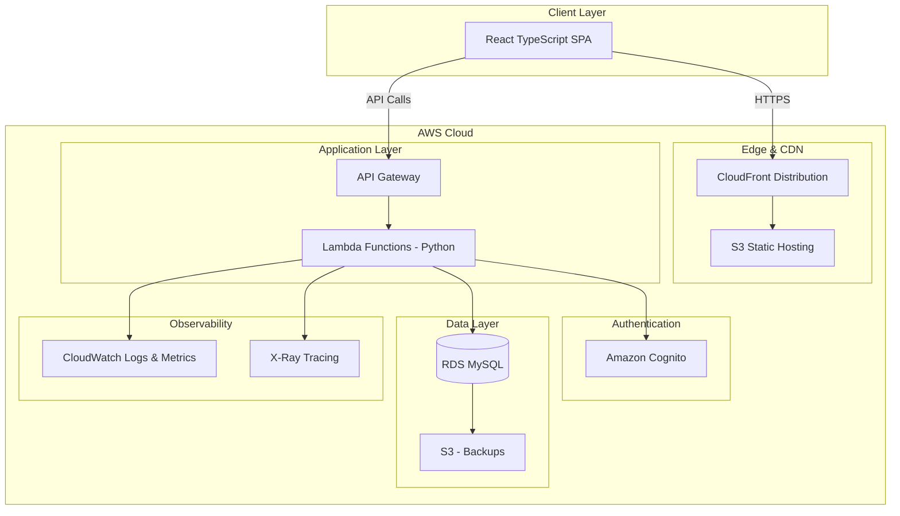
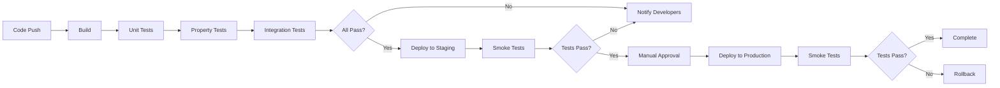

# Design Document: Card Collection Platform

## Overview

The Card Collection Platform is a cloud-native, serverless full-stack web application built on AWS infrastructure. The system follows a three-tier architecture with a React TypeScript frontend, Python Lambda functions for the backend API layer, and a managed MySQL database. All infrastructure is defined using AWS CDK and organized in a monorepo structure with separate packages for infrastructure, backend, frontend, and CI/CD configurations.

The platform leverages AWS serverless and managed services to minimize operational overhead while providing automatic scalability, high availability, and cost efficiency. The architecture emphasizes separation of concerns, with clear boundaries between presentation, business logic, and data layers.

## Architecture

### High-Level Architecture



```

### Network Architecture

- **VPC**: Multi-AZ VPC with private subnets across 2+ availability zones for RDS
- **Private Subnets**: Host RDS instances
- **Lambda VPC Configuration**: Lambda functions connect to VPC to access RDS in private subnets
- **Security Groups**: Restrict traffic between Lambda functions and RDS
- **NAT Gateway**: Optional, for Lambda functions that need internet access while in VPC

### Technology Stack

**Infrastructure:**
- AWS CDK (TypeScript) for Infrastructure as Code
- AWS CodePipeline and CodeBuild for CI/CD
- AWS CloudFormation (generated by CDK)

**Backend:**
- Python 3.11+ for Lambda functions
- API Gateway REST API for API management
- Lambda Layers for shared dependencies and utilities
- Amazon Cognito for authentication
- RDS MySQL for data persistence

**Frontend:**
- React with TypeScript
- Hosted on S3 with CloudFront CDN
- Material-UI or similar component library

**Monitoring:**
- CloudWatch for logs and metrics
- X-Ray for distributed tracing
- CloudWatch Alarms for alerting

## Components and Interfaces

### Frontend Application

**Technology**: React + TypeScript, hosted on S3 + CloudFront

**Key Components:**
- **Authentication Module**: Handles Cognito integration and OpenID Connect flows
- **Card Management UI**: CRUD interfaces for card operations
- **Library Browser**: Pagination, filtering, and sorting components
- **Top Cards Showcase**: Home page display of selected cards
- **Profile Management**: User profile editing interface

**API Integration:**
- REST API client using fetch or axios
- JWT token management for authenticated requests
- Error handling and retry logic

### Backend API Service

**Technology**: Python Lambda functions with API Gateway

**Lambda Function Organization:**

1. **Authentication Functions**
   - `auth-register`: User registration with Cognito integration
   - `auth-login`: User login
   - `auth-federated`: Federated login via OpenID Connect
   - `auth-me`: Get current user info

2. **Card Functions**
   - `cards-create`: Create new card
   - `cards-get`: Get card by ID
   - `cards-update`: Update card
   - `cards-delete`: Delete card
   - `cards-list`: List cards with pagination, filtering, sorting

3. **Collection Functions**
   - `collections-list`: List all user collections (includes Top Cards collection at index 0)
   - `collections-create`: Create new collection
   - `collections-get`: Get collection by ID (Top Cards accessible via special system collection ID)
   - `collections-update`: Update collection (Top Cards name cannot be changed)
   - `collections-delete`: Delete collection (Top Cards cannot be deleted - system collection)
   - `collection-cards-list`: List cards in a collection (Top Cards enforces 20-card maximum)
   - `collection-cards-add`: Add card to collection (Top Cards limited to 20 cards)
   - `collection-cards-remove`: Remove card from collection (works for Top Cards)

4. **User Profile Functions**
   - `profile-get`: Get user profile
   - `profile-update`: Update user profile

**Shared Layers:**
- **Database Layer**: MySQL connection pooling, query utilities, ORM models
- **Auth Layer**: JWT validation, Cognito integration
- **Utils Layer**: Logging, error handling, validation utilities

**API Gateway Configuration:**
- REST API with resource-based routing
- Cognito User Pool Authorizer for protected endpoints
- Request validation at API Gateway level
- CORS configuration for frontend access
- API keys and usage plans for rate limiting

**API Endpoints:**

```

Authentication:
POST /api/auth/register
Body: { username, password, email }
Response: { userId, token }

POST /api/auth/login
Body: { username, password }
Response: { userId, token }

POST /api/auth/federated
Body: { provider, idToken }
Response: { userId, token }

GET /api/auth/me
Headers: Authorization: Bearer {token}
Response: { userId, username, email }

Cards:
POST /api/cards
Headers: Authorization: Bearer {token}
Body: {
playerFirstName: string,
playerLastName: string,
brand: string,
series: string,
cardType: string,
rarity: number
}
Response: { cardId, ...cardData }

GET /api/cards/{id}
Headers: Authorization: Bearer {token}
Response: { id, userId, playerFirstName, playerLastName, brand, series, cardType, rarity, createdAt, updatedAt }

PUT /api/cards/{id}
Headers: Authorization: Bearer {token}
Body: { playerFirstName?, playerLastName?, brand?, series?, cardType?, rarity? }
Response: { id, ...updatedCardData }

DELETE /api/cards/{id}
Headers: Authorization: Bearer {token}
Response: 204 No Content

GET /api/cards
Headers: Authorization: Bearer {token}
Query Parameters: - page: number (default: 1, min: 1) - pageSize: number (default: 20, min: 1, max: 100) - sortBy: string (playerFirstName|playerLastName|brand|series|cardType|rarity|createdAt, default: createdAt) - sortOrder: string (asc|desc, default: desc) - filterPlayerFirstName: string (partial match, case-insensitive) - filterPlayerLastName: string (partial match, case-insensitive) - filterBrand: string (exact match, case-insensitive) - filterSeries: string (exact match, case-insensitive) - filterCardType: string (exact match, case-insensitive) - filterRarity: number (exact match)
Response: {
data: [
{ id, userId, playerFirstName, playerLastName, brand, series, cardType, rarity, createdAt, updatedAt }
],
pagination: {
currentPage: number,
pageSize: number,
totalItems: number,
totalPages: number
}
}
Examples: - GET /api/cards?page=1&pageSize=20 - GET /api/cards?sortBy=rarity&sortOrder=desc - GET /api/cards?filterBrand=Topps&filterRarity=5 - GET /api/cards?filterPlayerLastName=Jordan&sortBy=createdAt&sortOrder=asc&page=2&pageSize=10

Collections:
GET /api/collections
Headers: Authorization: Bearer {token}
Response: [
{ id, name, isSystemCollection, cardCount, createdAt, updatedAt }
]
Note: Top Cards collection will have isSystemCollection=true and will always be included

POST /api/collections
Headers: Authorization: Bearer {token}
Body: { name: string }
Response: { id, name, isSystemCollection, createdAt, updatedAt }

GET /api/collections/{id}
Headers: Authorization: Bearer {token}
Response: { id, name, isSystemCollection, createdAt, updatedAt }

PUT /api/collections/{id}
Headers: Authorization: Bearer {token}
Body: { name: string }
Response: { id, name, updatedAt }

DELETE /api/collections/{id}
Headers: Authorization: Bearer {token}
Response: 204 No Content

GET /api/collections/{id}/cards
Headers: Authorization: Bearer {token}
Query Parameters: (same pagination, filtering, sorting as /api/cards)
Response: {
data: [{ id, playerFirstName, playerLastName, brand, series, cardType, rarity, position }],
pagination: { currentPage, pageSize, totalItems, totalPages }
}
Note: When {id} is the Top Cards collection, maximum 20 cards enforced

POST /api/collections/{id}/cards
Headers: Authorization: Bearer {token}
Body: { cardId: string, position?: number }
Response: { success: boolean }
Note: When {id} is the Top Cards collection, rejects if already at 20-card limit

DELETE /api/collections/{id}/cards/{cardId}
Headers: Authorization: Bearer {token}
Response: 204 No Content
Note: Works for Top Cards collection (system collection)

User Profile:
GET /api/profile
Headers: Authorization: Bearer {token}
Response: { id, username, firstName, lastName, birthdate, bio, createdAt, updatedAt }

PUT /api/profile
Headers: Authorization: Bearer {token}
Body: { firstName?, lastName?, birthdate?, bio? }
Response: { id, username, firstName, lastName, birthdate, bio, updatedAt }

````

### Database Layer

**Technology**: Amazon RDS MySQL

**Access Pattern:**
- Lambda functions connect via VPC configuration
- Connection pooling using RDS Proxy (optional for high concurrency)
- Read replicas for scaling read operations (optional)
- Automated backups to S3

### Infrastructure Components

**CDK Stacks:**

1. **Network Stack**
   - VPC with private subnets across 2+ availability zones
   - NAT Gateway (optional, for Lambda internet access)
   - Security Groups for Lambda and RDS
   - VPC Endpoints for AWS services (optional)

2. **Database Stack**
   - RDS MySQL instance in private subnets
   - RDS Proxy for connection pooling (optional)
   - Parameter groups
   - Backup configuration
   - Security groups

3. **API Stack**
   - API Gateway REST API
   - Lambda functions for all endpoints
   - Lambda Layers for shared code
   - Cognito Authorizer configuration
   - API Gateway deployment and stages

4. **Authentication Stack**
   - Cognito User Pool
   - Cognito User Pool Client
   - OpenID Connect identity providers
   - Lambda triggers for user lifecycle events (optional)

5. **Frontend Stack**
   - S3 bucket for static hosting
   - CloudFront distribution
   - SSL/TLS certificates

6. **Monitoring Stack**
   - CloudWatch log groups for Lambda functions
   - CloudWatch alarms for errors and throttling
   - X-Ray configuration for Lambda tracing
   - SNS topics for alerts

7. **CI/CD Stack**
   - CodePipeline
   - CodeBuild projects
   - Artifact storage

## Data Models

### Card Entity

```typescript
interface Card {
  id: string;                    // UUID
  userId: string;                // Foreign key to User
  playerFirstName: string;       // Required
  playerLastName: string;        // Required
  brand: string;                 // Required
  series: string;                // Required
  cardType: string;              // Required
  rarity: number;                // Required, integer
  createdAt: Date;
  updatedAt: Date;
}
````

**Database Schema:**

```sql
CREATE TABLE cards (
  id VARCHAR(36) PRIMARY KEY,
  user_id VARCHAR(36) NOT NULL,
  player_first_name VARCHAR(255) NOT NULL,
  player_last_name VARCHAR(255) NOT NULL,
  brand VARCHAR(255) NOT NULL,
  series VARCHAR(255) NOT NULL,
  card_type VARCHAR(255) NOT NULL,
  rarity INT NOT NULL,
  created_at TIMESTAMP DEFAULT CURRENT_TIMESTAMP,
  updated_at TIMESTAMP DEFAULT CURRENT_TIMESTAMP ON UPDATE CURRENT_TIMESTAMP,
  INDEX idx_user_id (user_id),
  INDEX idx_brand (brand),
  INDEX idx_rarity (rarity),
  FOREIGN KEY (user_id) REFERENCES users(id) ON DELETE CASCADE
);
```

### User Entity

```typescript
interface User {
  id: string; // UUID, matches Cognito sub
  username: string; // Unique
  firstName: string | null;
  lastName: string | null;
  birthdate: Date | null;
  bio: string | null;
  createdAt: Date;
  updatedAt: Date;
}
```

**Database Schema:**

```sql
CREATE TABLE users (
  id VARCHAR(36) PRIMARY KEY,
  username VARCHAR(255) UNIQUE NOT NULL,
  first_name VARCHAR(255),
  last_name VARCHAR(255),
  birthdate DATE,
  bio TEXT,
  created_at TIMESTAMP DEFAULT CURRENT_TIMESTAMP,
  updated_at TIMESTAMP DEFAULT CURRENT_TIMESTAMP ON UPDATE CURRENT_TIMESTAMP,
  INDEX idx_username (username)
);
```

### Collection Entity

```typescript
interface Collection {
  id: string; // UUID
  userId: string; // Foreign key to User
  name: string; // Required, collection name
  isSystemCollection: boolean; // True for Top Cards, false for user-created
  createdAt: Date;
  updatedAt: Date;
}
```

**Database Schema:**

```sql
CREATE TABLE collections (
  id VARCHAR(36) PRIMARY KEY,
  user_id VARCHAR(36) NOT NULL,
  name VARCHAR(255) NOT NULL,
  is_system_collection BOOLEAN DEFAULT FALSE,
  created_at TIMESTAMP DEFAULT CURRENT_TIMESTAMP,
  updated_at TIMESTAMP DEFAULT CURRENT_TIMESTAMP ON UPDATE CURRENT_TIMESTAMP,
  INDEX idx_user_id (user_id),
  INDEX idx_system_collection (user_id, is_system_collection),
  FOREIGN KEY (user_id) REFERENCES users(id) ON DELETE CASCADE
);
```

**Note:** Top Cards is a system collection (is_system_collection=TRUE) automatically created for each user. It cannot be deleted or renamed.

### CollectionCard Entity

```typescript
interface CollectionCard {
  collectionId: string; // Foreign key to Collection
  cardId: string; // Foreign key to Card
  position: number | null; // Optional ordering within collection, required for Top Cards (1-20)
  createdAt: Date;
}
```

**Database Schema:**

```sql
CREATE TABLE collection_cards (
  collection_id VARCHAR(36) NOT NULL,
  card_id VARCHAR(36) NOT NULL,
  position INT NULL,
  created_at TIMESTAMP DEFAULT CURRENT_TIMESTAMP,
  PRIMARY KEY (collection_id, card_id),
  FOREIGN KEY (collection_id) REFERENCES collections(id) ON DELETE CASCADE,
  FOREIGN KEY (card_id) REFERENCES cards(id) ON DELETE CASCADE,
  INDEX idx_collection_id (collection_id),
  INDEX idx_card_id (card_id),
  UNIQUE KEY unique_position_per_collection (collection_id, position)
);
```

**Note:** For Top Cards collection, position is required (1-20) and enforces ordering. For user collections, position is optional.

### Pagination Response

```typescript
interface PaginatedResponse<T> {
  data: T[];
  pagination: {
    currentPage: number;
    pageSize: number;
    totalItems: number;
    totalPages: number;
  };
}
```

### Filter and Sort Parameters

```typescript
interface CardQueryParams {
  page?: number;
  pageSize?: number;
  sortBy?:
    | "playerFirstName"
    | "playerLastName"
    | "brand"
    | "series"
    | "cardType"
    | "rarity"
    | "createdAt";
  sortOrder?: "asc" | "desc";
  filters?: {
    playerFirstName?: string;
    playerLastName?: string;
    brand?: string;
    series?: string;
    cardType?: string;
    rarity?: number;
  };
}
```

## Correctness Properties

_A property is a characteristic or behavior that should hold true across all valid executions of a system—essentially, a formal statement about what the system should do. Properties serve as the bridge between human-readable specifications and machine-verifiable correctness guarantees._

### Card Management Properties

**Property 1: Card creation adds to library**
_For any_ user and any valid card data, when a card is created, the user's library should contain that card with all properties intact.
**Validates: Requirements 1.1, 1.2, 2.1, 2.2, 2.3, 2.4, 2.5, 2.6**

**Property 2: Card update persistence**
_For any_ existing card and any valid property updates, when a card is updated, retrieving the card should return the updated values.
**Validates: Requirements 1.3**

**Property 3: Card deletion removes from library**
_For any_ card in a user's library, when the card is deleted, subsequent queries to the library should not return that card.
**Validates: Requirements 1.4**

**Property 4: Invalid card rejection**
_For any_ card data missing required fields or containing invalid values, attempting to create or update a card should be rejected with a validation error, and the library should remain unchanged.
**Validates: Requirements 1.5**

### Pagination Properties

**Property 5: Pagination completeness**
_For any_ library of cards and any valid page size, iterating through all pages should return every card exactly once, with no duplicates or omissions.
**Validates: Requirements 3.1, 3.2, 3.3**

**Property 6: Pagination metadata accuracy**
_For any_ paginated query result, the metadata should accurately reflect the total number of cards, current page number, page size, and total pages calculated correctly.
**Validates: Requirements 3.5**

### Filtering and Sorting Properties

**Property 7: Filter correctness**
_For any_ set of filter criteria applied to a library, all returned cards should match all specified filter criteria, and no matching cards should be excluded.
**Validates: Requirements 4.1, 4.2**

**Property 8: Sort order correctness**
_For any_ library and any sortable property, the returned cards should be ordered correctly (ascending or descending) by the specified property, with consistent ordering for equal values.
**Validates: Requirements 4.3, 4.4**

**Property 9: Filter and sort composition**
_For any_ library with combined filter and sort operations, the results should first satisfy all filter criteria, then be sorted by the specified property and order.
**Validates: Requirements 4.5**

### Top Cards Properties

**Property 10: Top cards auto-creation**
_For any_ newly created user account, a Top Cards collection should be automatically created and marked as a system collection.
**Validates: Requirements 5.1**

**Property 11: Top cards capacity constraint**
_For any_ user, the number of cards in their Top Cards collection should never exceed 20.
**Validates: Requirements 5.2, 5.3**

**Property 12: Top cards retrieval consistency**
_For any_ user with cards in their Top Cards collection, retrieving the top cards should return exactly the cards that were added, in the specified positions.
**Validates: Requirements 5.4**

**Property 13: Top cards removal consistency**
_For any_ card in a user's Top Cards collection, when the card is removed from the collection, subsequent retrieval should not include that card.
**Validates: Requirements 5.5**

**Property 14: Top cards cascade deletion**
_For any_ card that exists in both a user's library and their Top Cards collection, when the card is deleted from the library, it should automatically be removed from the Top Cards collection.
**Validates: Requirements 5.6**

### Collection Management Properties

**Property 15: Collection creation persistence**
_For any_ user and any valid collection name, when a collection is created, the user should be able to retrieve that collection with the same name.
**Validates: Requirements 5A.1**

**Property 16: Collection update persistence**
_For any_ existing collection and any valid name update, when the collection name is updated, retrieving the collection should return the updated name.
**Validates: Requirements 5A.3**

**Property 17: Collection deletion preserves cards**
_For any_ collection containing cards, when the collection is deleted, all cards in that collection should remain in the user's library.
**Validates: Requirements 5A.4**

**Property 18: Invalid collection rejection**
_For any_ collection with an empty or invalid name, attempting to create the collection should be rejected with a validation error.
**Validates: Requirements 5A.5**

### Collection Card Management Properties

**Property 19: Card addition to collection**
_For any_ user-owned card and any user-owned collection, when the card is added to the collection, retrieving the collection's cards should include that card.
**Validates: Requirements 5B.1**

**Property 20: Card removal from collection**
_For any_ card in a collection, when the card is removed from the collection, retrieving the collection's cards should not include that card, and the card should still exist in the library.
**Validates: Requirements 5B.2**

**Property 21: Collection card retrieval consistency**
_For any_ collection, retrieving the cards in that collection should return exactly the cards that have been added to it.
**Validates: Requirements 5B.3**

**Property 22: Card deletion cascade to collections**
_For any_ card that exists in one or more collections, when the card is deleted from the library, it should be automatically removed from all collections containing it.
**Validates: Requirements 5B.4**

**Property 23: Authorization for collection card addition**
_For any_ card not owned by a user, attempting to add that card to the user's collection should be rejected with an authorization error.
**Validates: Requirements 5B.5**

### Authentication Properties

**Property 24: Valid credential authentication**
_For any_ valid user credentials, authentication should succeed and grant access to that user's resources.
**Validates: Requirements 6.1, 6.2**

**Property 25: Invalid credential rejection**
_For any_ invalid credentials, authentication should fail and return an appropriate error without granting access.
**Validates: Requirements 6.4**

**Property 26: Session expiration enforcement**
_For any_ expired session token, requests requiring authentication should be rejected until re-authentication occurs.
**Validates: Requirements 6.5**

### User Profile Properties

**Property 27: Username uniqueness**
_For any_ username, at most one user account should exist with that username, and attempts to create duplicate usernames should be rejected.
**Validates: Requirements 7.1, 7.6**

**Property 28: Profile update persistence**
_For any_ user profile field (firstName, lastName, birthdate, bio) and any valid update value, when the field is updated, retrieving the profile should return the updated value.
**Validates: Requirements 7.2, 7.3, 7.4, 7.5**

### Security Properties

**Property 29: Authorization enforcement**
_For any_ protected resource and any user, access should only be granted if the user is authenticated and authorized for that specific resource.
**Validates: Requirements 11.3**

**Property 30: Input sanitization**
_For any_ API endpoint and any input containing potentially malicious content (SQL injection, XSS, etc.), the input should be validated and sanitized, preventing execution of malicious code.
**Validates: Requirements 11.5**

### Observability Properties

**Property 31: Error logging completeness**
_For any_ application error, an error log entry should be created with sufficient context (timestamp, error message, stack trace, request context) to enable debugging.
**Validates: Requirements 12.1**

**Property 32: Metrics emission**
_For any_ API request, metrics should be emitted including at minimum: request latency, success/failure status, and endpoint identifier.
**Validates: Requirements 12.3**

## Error Handling

### Error Categories

1. **Validation Errors (400 Bad Request)**

   - Missing required fields
   - Invalid data types
   - Constraint violations (e.g., rarity not an integer)
   - Business rule violations (e.g., more than 20 top cards)

2. **Authentication Errors (401 Unauthorized)**

   - Missing or invalid JWT token
   - Expired session
   - Invalid credentials

3. **Authorization Errors (403 Forbidden)**

   - Attempting to access another user's resources
   - Insufficient permissions

4. **Not Found Errors (404 Not Found)**

   - Requested card does not exist
   - User profile not found

5. **Conflict Errors (409 Conflict)**

   - Username already exists
   - Concurrent modification conflicts

6. **Server Errors (500 Internal Server Error)**
   - Database connection failures
   - Unexpected exceptions
   - External service failures

### Error Response Format

```typescript
interface ErrorResponse {
  error: {
    code: string; // Machine-readable error code
    message: string; // Human-readable error message
    details?: any; // Additional error context
    timestamp: string; // ISO 8601 timestamp
    requestId: string; // Unique request identifier for tracing
  };
}
```

### Error Handling Strategy

- **Retry Logic**: Implement exponential backoff for transient failures (database connection, external services)
- **Circuit Breaker**: Prevent cascading failures when dependencies are unavailable
- **Graceful Degradation**: Return partial results when possible rather than complete failure
- **Error Logging**: Log all errors with full context for debugging
- **User-Friendly Messages**: Return clear, actionable error messages to users
- **Security**: Avoid leaking sensitive information in error messages

## Testing Strategy

The Card Collection Platform employs a comprehensive testing strategy combining unit tests, property-based tests, and integration tests to ensure correctness, reliability, and maintainability.

### Unit Testing

**Framework**:

- Backend (Python): pytest + pytest-mock + moto (for AWS service mocking)
- Frontend: Jest + React Testing Library

**Coverage Areas**:

- Individual Lambda function handler behavior
- Lambda layer utility functions
- Database query construction and ORM operations
- Authentication token validation
- Input validation logic
- Frontend component rendering and user interactions

**Example Unit Tests**:

- Test that card creation Lambda returns 201 status with valid data
- Test that pagination utility constructs correct SQL query
- Test that username uniqueness check queries database correctly
- Test that JWT validation correctly extracts user ID from token
- Test that React Card component renders all properties
- Test that filter builder constructs correct WHERE clauses

### Property-Based Testing

**Framework**:

- Backend (Python): Hypothesis
- Frontend: fast-check

**Configuration**:

- Each property test MUST run a minimum of 100 iterations
- Each property test MUST be tagged with a comment referencing the design document property
- Tag format: `**Feature: card-collection-platform, Property {number}: {property_text}**`
- Each correctness property MUST be implemented by exactly ONE property-based test

**Property Test Implementation**:

Each of the 32 correctness properties defined above will be implemented as a property-based test. The tests will:

1. Generate random valid inputs (cards, users, queries, etc.)
2. Execute the operation under test
3. Verify the property holds for all generated inputs
4. Report any counterexamples that violate the property

**Example Property Tests**:

```python
from hypothesis import given, strategies as st
import pytest

# Property 1: Card creation adds to library
@given(card=valid_card_strategy(), user_id=st.uuids())
def test_card_creation_adds_to_library(card, user_id):
    """
    Feature: card-collection-platform, Property 1: Card creation adds to library
    """
    # Create card for user
    card_id = card_service.create_card(user_id, card)

    # Verify card exists in library with all properties intact
    retrieved = card_service.get_card(user_id, card_id)
    assert retrieved.player_first_name == card.player_first_name
    assert retrieved.player_last_name == card.player_last_name
    assert retrieved.brand == card.brand
    # ... verify all properties

# Property 5: Pagination completeness
@given(
    cards=st.lists(valid_card_strategy(), min_size=0, max_size=100),
    page_size=st.integers(min_value=1, max_value=50)
)
def test_pagination_returns_all_cards_exactly_once(cards, page_size):
    """
    Feature: card-collection-platform, Property 5: Pagination completeness
    """
    # Setup: Create all cards for a user
    user_id = setup_user_with_cards(cards)

    # Collect all cards from all pages
    all_card_ids = set()
    page = 1

    while True:
        response = card_service.get_cards(user_id, page, page_size)
        for card in response['data']:
            assert card['id'] not in all_card_ids  # No duplicates
            all_card_ids.add(card['id'])

        if page >= response['pagination']['totalPages']:
            break
        page += 1

    # Verify we got all cards
    assert len(all_card_ids) == len(cards)
```

### Integration Testing

**Scope**:

- End-to-end API workflows via API Gateway
- Lambda function integration with RDS
- Authentication flows with Cognito

- End-to-end API workflows via API Gateway
- Lambda function integration with RDS
- Authentication flows with Cognito
- Frontend-backend integration

**Example Integration Tests**:

- Complete user registration and card creation flow
- Authentication with Cognito and accessing protected Lambda endpoints
- Creating cards, adding to collections, then deleting cards
- Filtering and sorting with actual database queries
- Lambda cold start and warm execution performance

### Infrastructure Testing

**CDK Testing**:

- Snapshot tests for CloudFormation templates
- Fine-grained assertions on Lambda functions, API Gateway, and RDS resources
- Validation tests for stack synthesis

**Example**:

```typescript
test("API Gateway has Cognito authorizer configured", () => {
  const app = new cdk.App();
  const stack = new ApiStack(app, "TestStack");
  const template = Template.fromStack(stack);

  template.hasResourceProperties("AWS::ApiGateway::Authorizer", {
    Type: "COGNITO_USER_POOLS",
  });
});

test("Lambda functions have VPC configuration", () => {
  const app = new cdk.App();
  const stack = new ApiStack(app, "TestStack");
  const template = Template.fromStack(stack);

  template.hasResourceProperties("AWS::Lambda::Function", {
    VpcConfig: {
      SubnetIds: Match.anyValue(),
      SecurityGroupIds: Match.anyValue(),
    },
  });
});
```

### Test Execution Strategy

1. **Local Development**: Run unit tests and property tests on every code change
2. **Pre-Commit**: Run fast unit tests before allowing commits
3. **CI Pipeline**: Run full test suite (unit + property + integration) on every push
4. **Pre-Deployment**: Run integration tests against staging environment
5. **Post-Deployment**: Run smoke tests to verify deployment success

### Test Data Management

- **Generators**: Create smart generators for property tests that produce valid domain objects
- **Fixtures**: Maintain reusable test fixtures for common scenarios
- **Database**: Use test containers or in-memory databases for integration tests
- **Cleanup**: Ensure tests clean up resources to prevent interference

## Deployment Strategy

### Environments

1. **Development**: Individual developer environments using CDK deploy
2. **Staging**: Shared environment for integration testing
3. **Production**: Live environment serving end users

### CI/CD Pipeline



### Deployment Process

1. **Build Phase**: Package Lambda functions and layers, run linters, compile TypeScript CDK code
2. **Test Phase**: Execute all automated tests (unit, property-based, integration)
3. **Staging Deployment**: Deploy infrastructure and Lambda functions to staging using CDK
4. **Staging Validation**: Run integration and smoke tests against staging environment
5. **Production Approval**: Manual approval gate for production deployment
6. **Production Deployment**: Deploy using Lambda versioning and aliases
   - Create new Lambda version
   - Update alias to point to new version
   - API Gateway uses alias (not $LATEST)
   - Enables instant rollback by switching alias
7. **Production Validation**: Smoke tests and CloudWatch monitoring
8. **Rollback Plan**: Automated rollback by reverting alias to previous Lambda version if health checks fail

### Lambda Deployment Strategy

**Versioning and Aliases**:

- Each Lambda deployment creates an immutable version
- Use aliases (e.g., "live", "staging") to point to specific versions
- API Gateway integrates with Lambda alias, not version number
- Rollback = update alias to previous version (instant, no redeployment)

**Deployment Patterns**:

- **All-at-once**: Update alias immediately (fastest, higher risk)
- **Canary**: Route small percentage of traffic to new version, gradually increase
- **Linear**: Gradually shift traffic from old to new version over time

**Cold Start Mitigation**:

- Keep Lambda functions warm with CloudWatch Events (optional)
- Provision concurrency for critical functions (production only)
- Optimize package size to reduce cold start time

### Database Migrations

- Database schema created at first deployment (no migration tool needed for initial setup)
- Use Alembic for Python database migrations for future schema changes
- Backward-compatible migrations to support rollback
- Test schema changes in dev/staging before production
- For initial deployment: Schema creation scripts run as part of infrastructure setup

## Security Considerations

### Authentication and Authorization

- **Cognito User Pools**: Manage user authentication
- **JWT Tokens**: Stateless authentication for API requests
- **Token Expiration**: Short-lived access tokens (1 hour), refresh tokens for renewal
- **RBAC**: Role-based access control (future enhancement for admin roles)
- **Resource Ownership**: Users can only access their own cards and profile

### Data Protection

- **Encryption in Transit**: TLS 1.2+ for all communications
- **Encryption at Rest**: RDS encryption enabled, S3 bucket encryption
- **Secrets Management**: AWS Secrets Manager for database credentials
- **Parameter Store**: SSM Parameter Store for configuration

### Network Security

- **VPC Isolation**: Private subnets for compute and database
- **Security Groups**: Least-privilege access between components
- **WAF**: Web Application Firewall on CloudFront (optional)
- **DDoS Protection**: AWS Shield Standard included

### Input Validation

- **Schema Validation**: Validate all API inputs against schemas
- **SQL Injection Prevention**: Use parameterized queries
- **XSS Prevention**: Sanitize user-generated content
- **CSRF Protection**: CSRF tokens for state-changing operations

### Compliance

- **Audit Logging**: CloudTrail for AWS API calls
- **Access Logging**: API Gateway and CloudFront access logs
- **Data Retention**: Configurable retention policies for logs and backups
- **GDPR Considerations**: User data deletion capabilities

## Monitoring and Observability

### Metrics

**Application Metrics**:

- Request count, latency (p50, p95, p99)
- Error rates by endpoint
- Database query performance
- Cache hit rates

**Infrastructure Metrics**:

- **Lambda Metrics**:
  - Invocations (total, by function)
  - Errors and throttles
  - Duration (p50, p95, p99, max)
  - Concurrent executions
  - Cold start frequency and duration
  - Iterator age (for stream-based invocations)
- **API Gateway Metrics**:
  - Request count and latency
  - 4xx and 5xx error rates
  - Integration latency (Lambda execution time)
  - Cache hit/miss ratio
- **RDS Metrics**:
  - CPU, memory, connections, IOPS
  - Query performance and slow queries
  - Replication lag (if Multi-AZ)
- **CloudFront Metrics**:
  - Cache hit ratio
  - Request count by region
  - Error rates

### Logging

**Log Aggregation**: CloudWatch Logs with log groups per service

**Log Levels**:

- ERROR: Application errors requiring attention
- WARN: Potential issues or degraded performance
- INFO: Important business events (user registration, card creation)
- DEBUG: Detailed diagnostic information (development only)

**Structured Logging**: JSON format with consistent fields:

```json
{
  "timestamp": "2026-01-03T10:30:00Z",
  "level": "ERROR",
  "service": "card-service",
  "requestId": "abc-123",
  "userId": "user-456",
  "message": "Failed to create card",
  "error": "Database connection timeout",
  "stackTrace": "..."
}
```

### Tracing

- **AWS X-Ray**: Distributed tracing across services
- **Trace Context**: Propagate trace IDs through all components
- **Service Map**: Visualize dependencies and latencies

### Alerting

**Critical Alerts** (PagerDuty/SNS):

- API error rate > 5%
- Database connection failures
- Lambda function failures or high error rates
- RDS storage < 10% free

**Warning Alerts** (Email/Slack):

- API latency p95 > 1 second
- Database CPU > 80%
- Lambda function duration approaching timeout
- Elevated 4xx error rates

### Dashboards

- **Application Dashboard**: Request rates, latencies, error rates by endpoint
- **Lambda Dashboard**:
  - Invocations, errors, duration by function
  - Concurrent executions and throttles
  - Cold start metrics
  - Memory utilization
- **Infrastructure Dashboard**:
  - RDS performance metrics
  - API Gateway metrics
  - CloudFront cache performance
- **Business Dashboard**: User registrations, cards created, active users
- **Business Dashboard**: User registrations, cards created, active users

## Performance Considerations

### Lambda Optimization

- **Memory Allocation**: Right-size memory (affects CPU allocation)
  - Start with 512MB for dev, tune based on CloudWatch metrics
  - Higher memory = more CPU = faster execution (may reduce cost)
- **Cold Start Reduction**:
  - Minimize package size (use Lambda layers for dependencies)
  - Use provisioned concurrency for critical functions (production)
  - Keep functions warm with CloudWatch Events (optional)
  - Avoid VPC for functions that don't need database access
- **Execution Time**:
  - Optimize imports (import only what's needed)
  - Reuse connections across invocations (database, HTTP clients)
  - Use connection pooling with RDS Proxy for high concurrency
- **Concurrency Management**:
  - Set reserved concurrency to prevent one function from consuming all capacity
  - Monitor throttling and adjust limits as needed

### Database Optimization

- **Indexing**: Indexes on user_id, brand, rarity, username, collection_id
- **Query Optimization**: Use EXPLAIN to optimize slow queries
- **Connection Pooling**:
  - Reuse database connections across Lambda invocations
  - Use RDS Proxy for connection pooling at scale
  - Set appropriate connection timeouts
- **Read Replicas**: Scale read operations (future enhancement)

### Caching Strategy

- **Application Cache**: Redis/ElastiCache for frequently accessed data
  - Cache user sessions, frequently accessed collections
  - Use cache-aside pattern with TTL
- **CDN Caching**: CloudFront caches static assets
  - Set appropriate cache headers
  - Invalidate cache on deployments
- **API Response Caching**:
  - API Gateway caching for GET requests
  - Cache by query parameters
  - Set appropriate TTLs (e.g., 5 minutes for card lists)

### Scalability

- **Horizontal Scaling**: Lambda auto-scales automatically based on concurrent requests
  - Default: 1000 concurrent executions per region
  - Can request limit increase from AWS
- **Database Scaling**:
  - Vertical scaling for RDS (change instance type)
  - Read replicas for read-heavy workloads
  - Consider Aurora Serverless for variable workloads
- **Stateless Design**: Lambda functions are stateless for easy scaling
- **Async Processing**: Use SQS for background tasks (future enhancement)
  - Email notifications
  - Batch operations
  - Report generation

## Future Enhancements

- **Social Features**: Share collections, follow other users
- **Search**: Full-text search for cards using OpenSearch
- **Image Upload**: Store card images in S3
- **Price Tracking**: Integration with card pricing APIs
- **Mobile App**: Native iOS/Android applications
- **Real-time Updates**: WebSocket support for live updates
- **Analytics**: Advanced analytics on collection value and trends
- **Export**: Export collection to CSV/PDF
