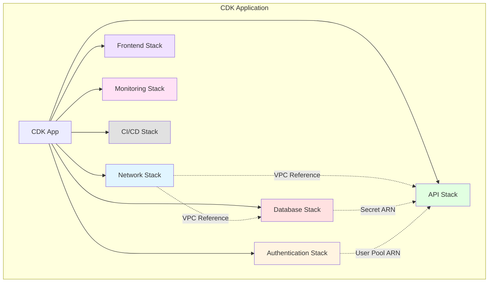
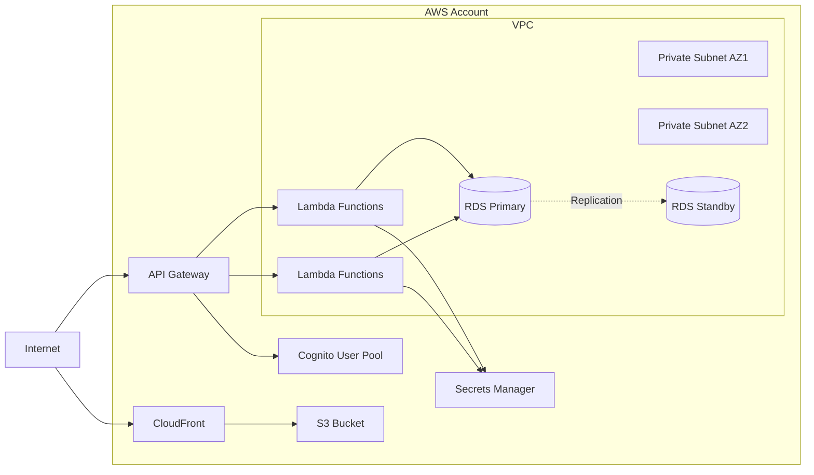

# Design Document: IndexCards Infrastructure

## Overview

The IndexCards Infrastructure is a complete AWS serverless infrastructure defined using AWS CDK (TypeScript). It provides all cloud resources needed to run the IndexCards platform, including networking, compute (Lambda), storage (RDS MySQL), authentication (Cognito), API management (API Gateway), content delivery (CloudFront), and monitoring (CloudWatch). The infrastructure is designed for multi-environment deployment with automated CI/CD pipelines.

## Architecture

### Infrastructure Stack Organization



### Deployment Architecture



## CDK Project Structure

```
infrastructure/
├── bin/
│   └── app.ts                 # CDK app entry point
├── lib/
│   ├── stacks/
│   │   ├── network-stack.ts   # VPC, subnets, security groups
│   │   ├── database-stack.ts  # RDS MySQL, Secrets Manager
│   │   ├── auth-stack.ts      # Cognito User Pool
│   │   ├── api-stack.ts       # API Gateway, Lambda functions
│   │   ├── frontend-stack.ts  # S3, CloudFront
│   │   ├── monitoring-stack.ts # CloudWatch, X-Ray
│   │   └── cicd-stack.ts      # CodePipeline, CodeBuild
│   ├── constructs/
│   │   ├── lambda-function.ts # Reusable Lambda construct
│   │   └── api-route.ts       # Reusable API route construct
│   └── config/
│       ├── environment.ts     # Environment configuration
│       └── constants.ts       # Shared constants
├── test/
│   ├── network-stack.test.ts
│   ├── database-stack.test.ts
│   ├── api-stack.test.ts
│   └── ...
├── cdk.json                   # CDK configuration
├── cdk.context.json          # Environment contexts
├── package.json
└── tsconfig.json
```

## Stack Designs

### 1. Network Stack

**Purpose**: Provides VPC, subnets, and network security

**Resources**:

- VPC with CIDR 10.0.0.0/16
- Private subnets in 2+ availability zones
- VPC Endpoints for S3, Secrets Manager, CloudWatch (cost optimization)
- Security Groups for Lambda and RDS
- Optional NAT Gateway for Lambda internet access

**Exports**:

- VPC ID
- Private subnet IDs
- Lambda security group ID
- RDS security group ID

**Configuration Parameters**:

- `enableNatGateway`: boolean (default: false for dev, true for prod)
- `vpcCidr`: string (default: "10.0.0.0/16")
- `availabilityZones`: number (default: 2)

### 2. Database Stack

**Purpose**: Provides managed MySQL database

**Resources**:

- RDS MySQL instance (Multi-AZ for production)
- DB Subnet Group using private subnets from Network Stack
- Secrets Manager secret for database credentials
- Security group allowing access from Lambda security group
- Automated backups with 7-day retention (configurable)
- KMS key for encryption at rest

**Exports**:

- Database endpoint
- Database secret ARN
- Database name

**Configuration Parameters**:

- `instanceType`: string (t3.micro for dev, t3.small for staging, t3.medium for prod)
- `allocatedStorage`: number (20GB for dev, 100GB for prod)
- `multiAz`: boolean (false for dev/staging, true for prod)
- `backupRetention`: number (1 day for dev, 7 days for prod)
- `deletionProtection`: boolean (false for dev/staging, true for prod)
- `databaseName`: string (default: "card_collection")

### 3. Authentication Stack

**Purpose**: Provides user authentication via Cognito

**Resources**:

- Cognito User Pool with password policy
- User Pool Client for web application
- User Pool Domain for hosted UI (optional)
- Identity providers for OpenID Connect (optional)

**Exports**:

- User Pool ID
- User Pool ARN
- User Pool Client ID
- User Pool Domain (if configured)

**Configuration Parameters**:

- `passwordMinLength`: number (default: 8)
- `requireUppercase`: boolean (default: true)
- `requireNumbers`: boolean (default: true)
- `requireSymbols`: boolean (default: true)
- `mfaEnabled`: boolean (default: false for dev, optional for prod)

### 4. API Stack

**Purpose**: Provides serverless API with Lambda functions and API Gateway

**Resources**:

**Lambda Layers**:

- Database Layer (pymysql, SQLAlchemy)
- Auth Layer (PyJWT, boto3 for Cognito)
- Utils Layer (logging, validation utilities)

**Lambda Functions** (all with VPC configuration):

- `auth-register`: User registration
- `auth-login`: User login
- `auth-federated`: Federated login
- `auth-me`: Get current user
- `cards-create`: Create card
- `cards-get`: Get card by ID
- `cards-update`: Update card
- `cards-delete`: Delete card
- `cards-list`: List cards with pagination/filtering
- `collections-list`: List collections (includes Top Cards at index 0)
- `collections-create`: Create collection
- `collections-get`: Get collection (Top Cards accessible via special ID or index 0)
- `collections-update`: Update collection (Top Cards name cannot be changed)
- `collections-delete`: Delete collection (Top Cards cannot be deleted)
- `collection-cards-list`: List cards in collection (works for Top Cards with 20-card limit)
- `collection-cards-add`: Add card to collection (Top Cards enforces 20-card maximum)
- `collection-cards-remove`: Remove card from collection (works for Top Cards)
- `profile-get`: Get user profile
- `profile-update`: Update user profile

**API Gateway**:

- REST API with Cognito User Pool Authorizer
- Routes for all Lambda functions
- CORS configuration
- Request validation
- CloudWatch logging enabled
- X-Ray tracing enabled

**Exports**:

- API Gateway URL
- API Gateway ID

**Configuration Parameters**:

- `lambdaMemory`: number (512MB for dev, 1024MB for prod)
- `lambdaTimeout`: number (30 seconds default)
- `apiStageName`: string (dev, staging, prod)
- `enableApiLogging`: boolean (default: true)

### 5. Frontend Stack

**Purpose**: Provides static website hosting with CDN

**Resources**:

- S3 bucket for static website hosting
- CloudFront distribution with S3 origin
- SSL/TLS certificate from ACM
- Origin Access Identity for S3 access
- Cache policies for static assets
- Error response configuration (404/403 → index.html)

**Exports**:

- CloudFront distribution URL
- CloudFront distribution ID
- S3 bucket name

**Configuration Parameters**:

- `domainName`: string (optional custom domain)
- `certificateArn`: string (optional existing certificate)
- `cacheTtl`: number (default: 3600 seconds)

### 6. Monitoring Stack

**Purpose**: Provides observability and alerting

**Resources**:

- CloudWatch Log Groups for all Lambda functions
- CloudWatch Alarms:
  - Lambda error rate > 5%
  - Lambda throttling
  - Lambda duration > 10 seconds
  - RDS CPU > 80%
  - RDS storage < 10% free
  - API Gateway 5xx errors > 1%
- SNS Topic for alarm notifications
- X-Ray tracing configuration
- CloudWatch Dashboard with key metrics

**Exports**:

- SNS Topic ARN for alarms
- Dashboard URL

**Configuration Parameters**:

- `alarmEmail`: string (email for alarm notifications)
- `enableDetailedMonitoring`: boolean (default: false for dev, true for prod)

### 7. CI/CD Stack

**Purpose**: Provides automated deployment pipeline

**Resources**:

- CodePipeline with stages:
  - Source (GitHub/CodeCommit)
  - Build (CDK synth)
  - Deploy (CloudFormation)
  - Manual approval (for production)
- CodeBuild project for CDK synthesis
- S3 bucket for pipeline artifacts
- IAM roles for pipeline execution

**Configuration Parameters**:

- `repositoryName`: string
- `branchName`: string (main, develop, etc.)
- `requireApproval`: boolean (false for dev, true for prod)

## Environment Configuration

### CDK Context Structure

```json
{
  "environments": {
    "dev": {
      "account": "123456789012",
      "region": "us-east-1",
      "vpcCidr": "10.0.0.0/16",
      "enableNatGateway": false,
      "dbInstanceType": "t3.micro",
      "dbAllocatedStorage": 20,
      "dbMultiAz": false,
      "lambdaMemory": 512,
      "requireApproval": false
    },
    "staging": {
      "account": "123456789012",
      "region": "us-east-1",
      "vpcCidr": "10.1.0.0/16",
      "enableNatGateway": false,
      "dbInstanceType": "t3.small",
      "dbAllocatedStorage": 50,
      "dbMultiAz": false,
      "lambdaMemory": 1024,
      "requireApproval": false
    },
    "prod": {
      "account": "987654321098",
      "region": "us-east-1",
      "vpcCidr": "10.2.0.0/16",
      "enableNatGateway": true,
      "dbInstanceType": "t3.medium",
      "dbAllocatedStorage": 100,
      "dbMultiAz": true,
      "lambdaMemory": 1024,
      "requireApproval": true
    }
  }
}
```

## Deployment Strategy

### Stack Deployment Order

1. **Network Stack** - Creates VPC and networking resources
2. **Database Stack** - Creates RDS (depends on Network)
3. **Authentication Stack** - Creates Cognito (independent)
4. **API Stack** - Creates Lambda and API Gateway (depends on Network, Database, Auth)
5. **Frontend Stack** - Creates S3 and CloudFront (independent)
6. **Monitoring Stack** - Creates CloudWatch resources (depends on API)
7. **CI/CD Stack** - Creates deployment pipeline (optional, can be deployed separately)

### Deployment Commands

```bash
# Deploy all stacks to dev environment
cdk deploy --all --context environment=dev

# Deploy specific stack
cdk deploy NetworkStack --context environment=dev

# Deploy with approval
cdk deploy --all --context environment=prod --require-approval=any-change

# Destroy all stacks
cdk destroy --all --context environment=dev
```

## Security Considerations

### Network Security

- All Lambda functions run in VPC private subnets
- RDS is only accessible from Lambda security group
- No public internet access to database
- VPC endpoints reduce data transfer costs and improve security

### IAM Security

- Lambda execution roles follow least-privilege principle
- Separate roles for each Lambda function
- Database credentials stored in Secrets Manager, never in code
- API Gateway uses Cognito authorizer for authentication

### Data Security

- RDS encryption at rest using KMS
- SSL/TLS for all data in transit
- Secrets Manager automatic rotation (optional)
- CloudFront HTTPS only

## Cost Optimization

### Development Environment

- Single-AZ RDS (no Multi-AZ)
- Smaller instance types (t3.micro)
- No NAT Gateway (use VPC endpoints)
- Minimal Lambda memory allocation
- Shorter log retention (7 days)

### Production Environment

- Multi-AZ RDS for high availability
- Appropriate instance sizing based on load
- NAT Gateway for Lambda internet access
- Optimized Lambda memory for performance
- Longer log retention (30 days)
- Reserved capacity for predictable workloads

## Testing Strategy

### CDK Tests

**Snapshot Tests**:

```typescript
test("Network Stack snapshot", () => {
  const app = new cdk.App();
  const stack = new NetworkStack(app, "TestStack", {
    env: { account: "123456789012", region: "us-east-1" },
  });
  const template = Template.fromStack(stack);
  expect(template.toJSON()).toMatchSnapshot();
});
```

**Fine-Grained Tests**:

```typescript
test('RDS has encryption enabled', () => {
  const app = new cdk.App();
  const networkStack = new NetworkStack(app, 'NetworkStack', {...});
  const dbStack = new DatabaseStack(app, 'DatabaseStack', {
    vpc: networkStack.vpc,
    ...
  });
  const template = Template.fromStack(dbStack);

  template.hasResourceProperties('AWS::RDS::DBInstance', {
    StorageEncrypted: true
  });
});

test('Lambda functions have VPC configuration', () => {
  const template = Template.fromStack(apiStack);

  template.hasResourceProperties('AWS::Lambda::Function', {
    VpcConfig: {
      SubnetIds: Match.anyValue(),
      SecurityGroupIds: Match.anyValue()
    }
  });
});
```

### Integration Tests

- Deploy to ephemeral test environment
- Validate all stacks deploy successfully
- Test cross-stack references work correctly
- Verify Lambda can connect to RDS
- Validate API Gateway endpoints are accessible
- Clean up test environment after validation

## Monitoring and Observability

### Key Metrics

**Lambda Metrics**:

- Invocations
- Errors
- Duration (p50, p95, p99)
- Throttles
- Concurrent executions

**API Gateway Metrics**:

- Request count
- 4xx errors
- 5xx errors
- Latency
- Cache hit/miss ratio

**RDS Metrics**:

- CPU utilization
- Database connections
- Read/Write IOPS
- Free storage space
- Replication lag (Multi-AZ)

### Alarms

**Critical** (immediate action):

- Lambda error rate > 5%
- RDS CPU > 90%
- RDS storage < 5% free
- API Gateway 5xx rate > 5%

**Warning** (investigation needed):

- Lambda duration > 10 seconds
- RDS CPU > 80%
- RDS storage < 10% free
- Lambda throttling > 0

## Maintenance and Operations

### Database Migrations

- Database schema created at first deployment (no migration tool needed for initial setup)
- Use Alembic for Python database migrations for future schema changes
- Backward-compatible migrations to support rollback
- Test schema changes in dev/staging before production

### Secrets Rotation

- Enable automatic rotation for RDS credentials
- Lambda function for rotation logic
- Update Lambda environment variables after rotation

### Backup and Recovery

- Automated RDS snapshots (daily)
- Point-in-time recovery enabled
- Cross-region backup replication for production
- Documented recovery procedures

### Scaling

- Lambda auto-scales automatically
- RDS vertical scaling (change instance type)
- RDS read replicas for read-heavy workloads
- API Gateway throttling limits configurable

## Future Enhancements

- **RDS Proxy**: Connection pooling for Lambda
- **WAF**: Web Application Firewall for API Gateway
- **Route 53**: DNS management for custom domains
- **ElastiCache**: Redis caching layer
- **SQS**: Async processing queues
- **EventBridge**: Event-driven architecture
- **Step Functions**: Complex workflow orchestration
