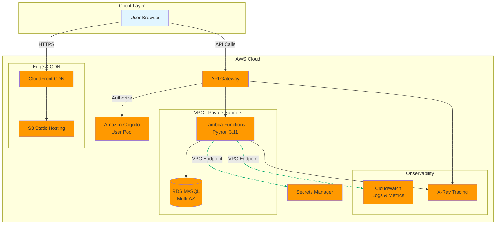

# IndexCards

```
  ╔═══════════════╗        ╔═══════════════╗
  ║   ⚾ TOPPS    ║        ║   ⚡ POKEMON  ║
  ║               ║        ║               ║
  ║   [Player]    ║        ║   PIKACHU     ║
  ║   Portrait    ║        ║    ⚡⚡⚡      ║
  ║               ║        ║   HP: 60      ║
  ║               ║        ║               ║
  ║ Mookie Betts  ║        ║ ⚡ Thunder    ║
  ║ Dodgers • SS  ║        ║   Shock  30   ║
  ║ Series 1 #50  ║        ║ ⚡⚡ Electro   ║
  ║ Rarity: ★★★★★ ║        ║   Ball   50   ║
  ╚═══════════════╝        ╚═══════════════╝
```

A cloud-native card collection platform for managing and showcasing your trading card collections.

## Overview

IndexCards enables collectors to digitally catalog their trading cards with detailed attributes, organize them into custom collections, and showcase their top 20 favorite cards. Built on AWS serverless architecture with a modern React frontend.

## Features

- **Card Library Management** - Full CRUD operations for your card collection
- **Advanced Search** - Filter and sort by player name, brand, series, type, and rarity
- **Custom Collections** - Organize cards into user-defined collections
- **Top Cards Showcase** - Display up to 20 favorite cards on your home page
- **User Profiles** - Manage personal information and bio
- **Secure Authentication** - Amazon Cognito with OpenID Connect support

## Architecture



### Technology Stack

- **Frontend**: React + TypeScript, hosted on S3 + CloudFront
- **Backend**: Python Lambda functions with API Gateway
- **Database**: Amazon RDS MySQL
- **Authentication**: Amazon Cognito
- **Infrastructure**: AWS CDK (TypeScript)
- **Monitoring**: CloudWatch + X-Ray

## Project Structure

The project is organized as a monorepo with npm workspaces:

```
/
├── infrastructure/     # AWS CDK infrastructure code (TypeScript)
├── backend/           # Python Lambda functions and layers
├── frontend/          # React TypeScript application
├── shared/            # Shared TypeScript types
└── .kiro/             # Specs and steering documents
```

**Detailed structure:**
- See [SETUP.md](SETUP.md) for complete directory layout
- See [structure.md](.kiro/steering/structure.md) for conventions

**Key features:**
- npm workspaces for unified dependency management
- TypeScript project references for type sharing
- Independent builds for each package
- Shared types between infrastructure and frontend

## Prerequisites

- Node.js 18+ and npm 9+
- Python 3.11+
- AWS CLI configured with appropriate credentials
- AWS CDK CLI: `npm install -g aws-cdk`

## Quick Start

```bash
# 1. Install all dependencies
npm install

# 2. Install backend dependencies
cd backend && pip install -r requirements.txt && cd ..

# 3. Build shared types
cd shared && npm run build && cd ..

# 4. Verify setup
npm run format:check && npm run lint
```

See [Getting Started](#getting-started) section below for detailed deployment instructions.

## Getting Started

### 1. Prerequisites

Ensure you have the following installed:
- Node.js 18+ and npm 9+
- Python 3.11+
- AWS CLI configured with credentials
- AWS CDK CLI: `npm install -g aws-cdk`

### 2. Initial Setup

```bash
# Install all workspace dependencies (root, infrastructure, frontend, shared)
npm install

# Install backend Python dependencies
cd backend
pip install -r requirements.txt
pip install -e ".[dev]"
cd ..

# Build shared types package
cd shared
npm run build
cd ..
```

### 3. Verify Setup

```bash
# Check code formatting
npm run format:check

# Lint TypeScript code
npm run lint

# Run backend tests
cd backend && pytest && cd ..

# Run frontend tests
cd frontend && npm test && cd ..
```

### 4. Bootstrap AWS Environment

```bash
# Bootstrap CDK in your AWS account (one-time setup per account/region)
cd infrastructure
cdk bootstrap aws://ACCOUNT-ID/REGION
```

### 5. Configure Environment

Create `infrastructure/cdk.context.json` with your environment settings:

```json
{
  "environments": {
    "dev": {
      "account": "YOUR-AWS-ACCOUNT-ID",
      "region": "us-east-1",
      "vpcCidr": "10.0.0.0/16",
      "enableNatGateway": false,
      "dbInstanceType": "t3.micro",
      "dbAllocatedStorage": 20,
      "dbMultiAz": false,
      "lambdaMemory": 512,
      "requireApproval": false
    }
  }
}
```

### 6. Deploy Infrastructure (When Ready)

```bash
# Deploy all infrastructure stacks to dev
cd infrastructure
cdk deploy --all --context environment=dev

# Note: This will create VPC, RDS, Cognito, Lambda functions, API Gateway, etc.
# Deployment takes approximately 15-20 minutes
```

### 7. Initialize Database Schema (After Infrastructure Deployment)

```bash
# After infrastructure is deployed, run database migrations
cd backend
# Run schema creation script (to be implemented in task 8)
python scripts/init_db.py --environment dev
```

### 8. Build and Deploy Frontend (After Infrastructure Deployment)

```bash
cd frontend
npm run build

# Get S3 bucket name from CDK outputs
aws s3 sync dist/ s3://YOUR-FRONTEND-BUCKET-NAME

# Invalidate CloudFront cache
aws cloudfront create-invalidation \
  --distribution-id YOUR-DISTRIBUTION-ID \
  --paths "/*"
```

### 9. Access the Application

```bash
# Get API Gateway URL from CDK outputs
export API_URL="https://your-api-id.execute-api.us-east-1.amazonaws.com/dev"

# Access frontend via CloudFront URL (from CDK outputs)
```

## Development Workflow

### Monorepo Commands

```bash
# Run from root directory

# Install/update all workspace dependencies
npm install

# Lint all TypeScript code
npm run lint

# Format all code
npm run format

# Check formatting without changes
npm run format:check

# Build all packages
npm run build

# Run all tests
npm run test
```

### Local Backend Development

```bash
cd backend

# Install dependencies
pip install -r requirements.txt

# Run tests
pytest

# Run specific test
pytest test/test_cards.py -v

# Run with coverage
pytest --cov=functions --cov=layers
```

### Local Frontend Development

```bash
cd frontend

# Install dependencies
npm install

# Start development server
npm run dev

# Run tests
npm test

# Build for production
npm run build
```

### Infrastructure Changes

```bash
cd infrastructure

# Synthesize CloudFormation templates
npm run synth

# View changes before deploying
cdk diff --context environment=dev

# Deploy specific stack
cdk deploy NetworkStack --context environment=dev

# Deploy all stacks
cdk deploy --all --context environment=dev

# Destroy all stacks (careful!)
cdk destroy --all --context environment=dev

# Run infrastructure tests
npm test
```

### Shared Types

```bash
cd shared

# Build types (required before using in other packages)
npm run build

# Watch for changes and rebuild
npm run watch
```

## Testing

The project uses a comprehensive testing strategy:

- **Unit Tests**: All components and functions
- **Property-Based Tests**: Hypothesis (Python) and fast-check (TypeScript)
  - Each property test runs minimum 100 iterations
  - Tests universal properties across all valid inputs
- **Integration Tests**: End-to-end API workflows
- **Infrastructure Tests**: CDK snapshot and assertion tests

### Running Tests

```bash
# Run all tests across all packages
npm run test

# Backend tests
cd backend
pytest                    # All tests
pytest -m unit           # Unit tests only
pytest -m property       # Property-based tests only
pytest --cov             # With coverage

# Frontend tests
cd frontend
npm test                 # Run once
npm run test:watch       # Watch mode
npm run test:coverage    # With coverage

# Infrastructure tests
cd infrastructure
npm test
```

Each correctness property defined in the design document has a dedicated property-based test.

## Environments

The project supports multiple environments configured via CDK context:

- **dev**: Development environment with minimal resources
- **staging**: Pre-production environment
- **prod**: Production environment with Multi-AZ RDS, enhanced monitoring

## API Documentation

### Authentication Endpoints

- `POST /api/auth/register` - Create new user account
- `POST /api/auth/login` - Authenticate user
- `POST /api/auth/federated` - Federated login via OpenID Connect
- `GET /api/auth/me` - Get current user info

### Card Endpoints

- `POST /api/cards` - Create new card
- `GET /api/cards` - List cards (with pagination, filtering, sorting)
- `GET /api/cards/{id}` - Get card by ID
- `PUT /api/cards/{id}` - Update card
- `DELETE /api/cards/{id}` - Delete card

### Collection Endpoints

- `GET /api/collections` - List all collections (includes Top Cards)
- `POST /api/collections` - Create new collection
- `GET /api/collections/{id}` - Get collection details
- `PUT /api/collections/{id}` - Update collection name
- `DELETE /api/collections/{id}` - Delete collection
- `GET /api/collections/{id}/cards` - List cards in collection
- `POST /api/collections/{id}/cards` - Add card to collection
- `DELETE /api/collections/{id}/cards/{cardId}` - Remove card from collection

### Profile Endpoints

- `GET /api/profile` - Get user profile
- `PUT /api/profile` - Update user profile

All protected endpoints require JWT token in `Authorization: Bearer {token}` header.

## Monitoring

- **CloudWatch Logs**: All Lambda function logs
- **CloudWatch Metrics**: Request count, latency, errors
- **CloudWatch Alarms**: Error rates, throttling, resource utilization
- **X-Ray Tracing**: Distributed tracing across services
- **CloudWatch Dashboards**: Key metrics visualization

## Security

- Data encrypted at rest (RDS, S3)
- Data encrypted in transit (TLS/HTTPS)
- VPC isolation for Lambda and RDS
- Least-privilege IAM roles
- Input validation and sanitization
- Secrets stored in AWS Secrets Manager

### Network Architecture

**All Lambda functions run in VPC private subnets** to access RDS MySQL database. This design ensures:

- ✅ Secure database access (no public internet exposure)
- ✅ Consistent security posture across all functions
- ✅ All functions can access database for user records and collections

**NAT Gateway Strategy:**

- **Dev/Staging**: Optional (disabled by default for cost savings)
- **Production**: Enabled (required for Lambda to access Cognito and external services)

**VPC Endpoints** configured for:

- S3 (for backups and static assets)
- Secrets Manager (for database credentials)
- CloudWatch (for logs and metrics)

This eliminates NAT Gateway costs for AWS service communication while maintaining security.

**Why all Lambdas are in VPC:**

- `auth-register` creates user records and Top Cards collection in database
- `auth-me` retrieves user profile from database
- All card/collection functions require database access
- Consistent deployment pattern simplifies operations

## Contributing

1. Review the specs in `.kiro/specs/` for requirements and design
2. Follow the project structure conventions in [structure.md](.kiro/steering/structure.md)
3. Write tests for all new functionality (unit + property-based)
4. Ensure all tests pass: `npm run test`
5. Format and lint code: `npm run format && npm run lint`
6. Update documentation as needed

### Development Process

- Infrastructure changes go in `infrastructure/lib/stacks/`
- Backend Lambda functions in `backend/functions/`
- Frontend components in `frontend/src/`
- Shared types in `shared/types/`

### Code Quality Standards

- TypeScript: ESLint + Prettier
- Python: Black + Flake8 + Mypy
- All code must pass linting and formatting checks
- Minimum test coverage requirements apply

## License

Apache License 2.0 - See [LICENSE](LICENSE) for details.

## Documentation

### Project Documentation
- [SETUP.md](SETUP.md) - Complete monorepo setup guide
- [Product Overview](.kiro/steering/product.md)
- [Technology Stack](.kiro/steering/tech.md)
- [Project Structure](.kiro/steering/structure.md)

### Specifications
- [Requirements](.kiro/specs/card-collection-platform/requirements.md)
- [Design Document](.kiro/specs/card-collection-platform/design.md)
- [Implementation Tasks](.kiro/specs/card-collection-platform/tasks.md)
- [Infrastructure Requirements](.kiro/specs/card-platform-infrastructure/requirements.md)
- [Infrastructure Design](.kiro/specs/card-platform-infrastructure/design.md)

### Package Documentation
- [Infrastructure README](infrastructure/README.md)
- [Backend README](backend/README.md)
- [Frontend README](frontend/README.md)
- [Shared README](shared/README.md)
